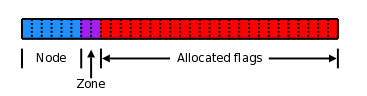

# Process memory space

<!-- *intentionally not shown the kernel mapping* -->


# Process memory space

- Virtual memory map
	- Allocation and freeing of automatic variables on stack.
	- Mapping of zero pages to bss section to initialize static variables.
	- Malloc acquires memory through `brk/sbrk` and `mmap` system calls.

*bss: Block Started by Symbol*

Next up *Memory descriptor*

# struct mm_struct(simplified)

```C
struct mm_struct
{
	struct{
		struct vm_are_struct *mmap;
		struct rb_root mm_rb;
		struct vm_are_struct *mmap_cache;
		atomic_t mm_users;
		int map_count;
		unsigned long start_code, end_code;
		unsigned long start_data, end_data;
		unsigned long start_brk, brk;
		unsigned long start_stack;
		struct mm_rss_stat rss_stat;
		unsigned long total_vm;
		spinlock_t page_table_lock;
	}
}
```

# Some less talked about topics in C

- Allocation of dynamic memory on stack with alloca.
	- Allocates `size` bytes of space in the stack frame of the caller.
```C
#include <alloca.h>
void *alloca(size_t size)
```
- Also introduction of variable sized arrays in C99.
```C
for(i=0; i < n; i++)
{
	char foo[n+i];
	
	/* use foo */
}
```
- On each iteration, foo is dynamically created and automatically
  cleaned up when it falls out of scope.

Next up *paging*

<!---# Types of addresses:

- User virtual address 
- Kernel virtual address : yeh nhi pta, yeh dekhna padega
- Kernel logical address : yeh sort of pta hai but dekh lenge ek baar.
--->

# Paging

## What does a page represent?

- Kernel treats physical pages as the basic unit of memory management.
- Although processor can address anything as small as a byte or a word but the
  MMU deals in pages.
- Word size of a processor is an ambiguously defined term but usually it
  corresponds to the max size of the general purpose registers of the processor.

# Page representation in software

```C
struct page {
	unsigned long flags;
	atomic_t _refcount; /* References to this page */
	atomic_t _mapcount; /* References by a page table*/
	unsigned long private; 
	struct address_space *mapping;
	pgoff_t index;
	struct list_head lru;
}
```
*simplified version*

# Organization of struct page

```C
struct page {
	unsigned long flags;
	union {
		struct { /* For page cache and anonymous pages */
			....
		};
		struct { /* Slab, slob, and slub*/
			....
		};
		struct { /* Tail pages of compound pages */
			....
		};
		struct { /* Page table pages */
			....
		}; /* Followed by _mapcount, _refcount etc.*/
	}
}
```

# struct page: Page cache and anonymous pages

```C
struct page {
	unsigned long flags;
	struct {
		struct list_head lru;
		struct address_space *mapping;
		pgoff_t index;
		unsigned long private;
	};
	atomic_t _mapcount;
	atomic_t _refcount;
	unsigned long memcg_data;
}
```

# struct page: Tail pages of compound pages

```C
struct page {
	unsigned long flags;
	struct {
		unsigned long compound_head;
		unsigned char compound_dtor;
		unsigned char compound_order;
		atomic_t compound_mapcount;
		unsigned int compound_nr;
	};
	atomic_t _mapcount;
	atomic_t _refcount;
	unsigned long memcg_data;
}
```

# struct page: Page table pages

```C
struct page {
	unsigned long flags;
	struct {
		unsigned long _pt_pad_1;
		pgtable_t pmd_huge_pte;
		unsigned long _pt_pad_2;
		struct mm_struct *pt_mm; /* For x86 pgds only */
		spinlock_t *ptl;
	};
	atomic_t _mapcount;
	atomic_t _refcount;
	unsigned long memcg_data;
}
```

# Page flags

- There can be upto 28 page flags on a 64-bit system. 
	- For eg. PG_dirty, PG_head, PG_mlocked, PG_active etc.
- The flags variable is declared an unsigned long so on:
	- 32-bit systems it is 32 bits long.
	- 64-bit systems it is 64 bits long.
- The higher bits in the flags variable have been used to store the node and
  zone information of each page on NUMA systems.


# Page flags layout

- No sparsemem: 
```bash
	- |      NODE      | ZONE | ... | FLAGS |
```
- classic sparse with space for node:
```bash
	- | SECTION | NODE | ZONE | ... | FLAGS |
```
- classic sparse no space for node:
```bash
	- | SECTION |    ZONE     | ... | FLAGS |
```
- Also the variants with `last_cpu_id` exist.

# Page size

## Definitions

`from arch/arm64/include/asm/page-defs.h`
```C
#define PAGE_SHIFT (CONFIG_ARM64_PAGE_SHIFT)
#define PAGE_SIZE (1 << PAGE_SHIFT)
```

## Kconfig options for page size

- Configuring page sizes by config options.
- `from arch/arm64/Kconfig`
```bash
config ARM64_PAGE_SHIFT
	int
	default 16 if ARM64_64K_PAGES
	default 14 if ARM64_16K_PAGES
	default 12 /* For 4KB pages */
```

# Constraints with increase size of struct page

- Size of page struct on arm64 is usually ~ 60 bytes(0x3C).
- Any increase in struct page size is felt around a million times.

## Let's calculate

- In a 4GB RAM system with 4KB pages we will have 2^20 physical pages.
- That means around 60 MB would be consumed by page structures.

## Memory Folios

- Pages are going to be replaced by memory folios soon.

*Next up Kernel stack*

<!---# Page tables

- Introduction of Page tables
	- Improvements that multi-level page table brings
	- Critical code related to page tables.
	- Kernel newbies pe dekh sakte hain code flow ki details.
	- KPTI pe thodi roshni daal sakte hain.
--->

# Kernel Stack

- Problem and Solution

# Kernel Stack

## Problem at hand
- Each process has its own stack for use when it is running in the kernel; in
  current kernels, that stack is sized at either 8KB or (on 64-bit systems)
16KB of memory. 
- The stack lives in directly-mapped kernel memory, so it must be
physically contiguous. That requirement alone can be problematic since, as
memory gets fragmented, finding two or four physically contiguous pages can
become difficult.

## Userspace view
- Can be viewed from userspace with:
	- `cat /proc/<pid>/stack`.

# Kernel stack (continued)

## Things to lookout for

- Check autmatic variable allocation to avoid stack overflows.
- Recursion not allowed in the kernel.

## Defaults currently set.

- Size of stack: Configured by `THREAD_SIZE` macro.
	- Defined in `arch/arm64/include/asm/memory.h`
- For `arm64` the default size is: 
	- `16KB` if `KASAN` is disabled
	- `32KB` if `KASAN` is enabled.

## Solution
- [Virtual mapping of stacks](https://lwn.net/Articles/692208/)

# Common memory allocation APIs

- kmalloc : contiguous physical addresses.
- vmalloc : contiguous virtual addresses(may not be physically contiguous)
- kvmalloc : Calls kmalloc and if it fails calls vmalloc.
	
## Common use cases.

- kmalloc : the most commonly used API to get subpage sized memory.
- vmalloc : only valid use case in the kernel at the moment is to allocate
  memory when kernel modules are loaded.

# kmalloc internals

```C
void *kmalloc(size_t size, gfp_t flags)
```

- It might allocate more than the programmer asked for but it will atleast
  allocate the requested size.
- Max and min allocation capping are explained later using code.
- Declared with `__always_inline` to boost the fastpath allocations.
	- This attribute inlines the function independent of any restrictions
	  that otherwise apply to inlining
- Notice the difference with `inline` here since we don't want to leave it at
  compiler's discretion or the optimization level specified.

# kmalloc: min and max limits on allocation

- Min: 8 bytes
- Max: 4 MB, well actually 2 MB(explained later).

`from include/linux/slab.h`

```C
#define MAX_ORDER 11
#define KMALLOC_SHIFT_HIGH (PAGE_SHIFT+1) // 13
#define KMALLOC_SHIFT_MAX (MAX_ORDER+PAGE_SHIFT-1) // 22
#define KMALLOC_SHIFT_LOW 3
```

# kmalloc: min and max limits on allocation

`from include/linux/slab.h`

```C
/* Maximum allocatable size = 4MB */
#define KMALLOC_MAX_SIZE (1 << KMALLOC_SHIFT_MAX)
/* Max size for which we can use a slab cache = 8KB */
#define KMALLOC_CACHE_SIZE (1 << KMALLOC_SHIFT_HIGH)
/* Max order allocatable via the slab allocator = 10 */
#define KMALLOC_MAX_ORDER (KMALLOC_SHIFT_MAX - PAGE_SHIFT)
/* Minimum allocatable size = 8 bytes */
#define KMALLOC_MIN_SIZE (1 << KMALLOC_SHIFT_LOW)
```

# Allocation flags

- Action modifiers: Specify how the kernel is supposed to allocate memory.
- Zone modifiers: Specify from which zone to allocate the memory. 
- Type modifiers: Combination of action and zone modifiers as needed by a
  certain type of memory. 

# Examples

- Action modifiers: `__GFP_WAIT, __GFP_NOFAIL, __GFP_COMP etc.`
- Zone modifiers: `__GFP_DMA, __GFP_HIGHMEM etc.`
- Type modifiers: `GFP_ATOMIC, GFP_KERNEL, GFP_USER etc.`

## Commonly used type modifier flags

- `GFP_KERNEL`: Normal allocation and might block. To be used in process
  context when we can sleep.
- `GFP_ATOMIC`: High priority and cannot sleep. Can be used in interrupt handlers.
- `GFP_USER`: Might block. Used to allocate memory for userspace processes.

*GFP stands get free pages*

# Expansion of common modifiers

- `GFP_ATOMIC`: `(__GFP_HIGH)`
- `GFP_KERNEL`: `(__GFP_WAIT|__GFP_IO|__GFP_FS)`
- `GFP_USER`: `(__GFP_WAIT|__GFP_IO|__GFP_FS)`

# kmalloc code flow


# kmalloc code walkthrough

```C
static void *kmalloc(size_t size, gfp_t flags)
{
	if (__builtin_constant_p(size)) {
		unsigned int index;
		if (size > KMALLOC_MAX_CACHE_SIZE)
			return kmalloc_large(size, flags);
		index = kmalloc_index(size);

		if (!index)
			return ZERO_SIZE_PTR;

		return kmem_cache_alloc_trace(
			kmalloc_caches[kmalloc_type(flags)][index],
			flags, size);
	}
	return __kmalloc(size, flags);
} /* from include/linux/slab.h */
```

# kmalloc code walkthrough(continued)

## __builtin_constant_p

- You can use the built-in function `__builtin_constant_p` to determine if a value
  is known to be constant at compile time and hence that GCC can perform
constant-folding on expressions involving that value. 

*[Ref link](https://gcc.gnu.org/onlinedocs/gcc/Other-Builtins.html)*

# What is constant-folding?

- Expressions with constant operands can be evaluated at compile time, thus
  improving run-time performance and reducing code size by avoiding evaluation
at compile-time.
- Programmers generally do not write expressions such as `(3 + 5)` directly, but
  these expressions are relatively common after macro expansion and other
optimizations such as constant propagation.
- Since kmalloc would be inlined at all places due to `__always_inline` attribute
  we can optimize a lot of compile time determined constant size allocations. 

*[Constant folding](https://compileroptimizations.com/category/constant_folding.htm)*

*[Constant propagation](https://compileroptimizations.com/category/constant_propagation.htm)*

# kmalloc code walkthrough(continued)

- `KMALLOC_MAX_CACHE_SIZE`
	- Max size for which we use a slab cache.
	- For SLUB its value is 8KB.

```C
static void *kmalloc_large(size_t size, gfp_t flags)
{
	unsigned int order = get_order(size);
	return kmalloc_order_trace(size, flags, order);
}
```

# kmalloc code walkthrough(continued)

```C
static void *kmalloc_order_trace(size, flags, order)
{
	return kmalloc_order(size, flags, order);
}
```

*Argument types omitted intentionally.*

# kmalloc code walkthrough(continued)

```C
void *kmalloc_order(size, flags, order)
{
	void *ret;
	struct page *page;
	
	flags |= __GFP_COMP;
	page = alloc_pages(flags, order);
	ret = page ? page_address(page) : NULL;
	ret = kasan_kmalloc_large();
	kmemleak_alloc(ret, size, 1, flags);
	return ret;	
}
EXPORT_SYMBOL(kmalloc_order)
```

# kmalloc code walkthrough(continued)

## kmalloc_index()

- Figure out which kmalloc slab an allocation of a certain size belongs to.
```C
#define kmalloc_index(s) __kmalloc_index(s, true)
```

# kmalloc code walkthrough(continued)

`from include/linux/slab.h`

```C
unsigned int __kmalloc_index(size, size_is_constant)
{
	/* 0 = zero alloc */
	/* 1 = 65 to 96 bytes */
	/* 2 = 129 to 192 bytes */
	/* n = 2^(n-1)+1 to 2^n bytes */
}
```
Let's checkout `kmalloc_info` to understand this.


# ZERO_SIZE_PTR

- ZERO_SIZE_PTR will be returned for zero sized kmalloc requests.

```C
#define ZERO_SIZE_PTR ((void *)16)
#define ZERO_OR_NULL_PTR(x) ((unsigned long)(x) <= \
				(unsigned long)ZERO_SIZE_PTR)
```

# kmalloc code walkthrough(continued)

```C
static void *kmem_cache_alloc_trace(
			the_kmem_cache, flags, size)
{
	void *ret = kmem_cache_alloc(the_kmem_cache, flags);
	ret = kasan_malloc(the_kmem_cache, ret, size, flags);

	return ret;
}
```

<!---# kmalloc code walkthrough(continued)

```C
kmalloc_caches
```
--->

# Showing the kmalloc slab caches
`$ sudo cat /proc/slabinfo`

```bash
kmalloc-8k   <- 8KB = KMALLOC_MAX_CACHE_SIZE
kmalloc-4k  
kmalloc-2k  
kmalloc-1k  
kmalloc-512 
kmalloc-256 
kmalloc-192 <- Non-power 2 sized kmalloc cache
kmalloc-128 
kmalloc-96  <- Non-power 2 sized kmalloc cache
kmalloc-64  
kmalloc-32  
kmalloc-16  
kmalloc-8  <- 8 bytes = KMALLOC_MIN_SIZE
```

# kmalloc code walkthrough(continued)

*if CONFIG_ZONE_DMA is defined*

```C
enum kmalloc_cache_type kmalloc_type(flags)
{
	if(likely((flags & (__GFP_DMA|__GFP_RECLAIM)) == 0))
		return KMA_NORMAL;

	return flags & __GFP_DMA ? KMA_DMA : KMA_RECLAIM;
}
```

*KMA: KMALLOC*

# kmalloc code walkthrough(continued)

```C
void *__kmalloc(size, flags)
{
	struct kmem_cache *s;
	void *ret;

	if(unlikely(size > KMALLOC_MAX_CACHE_SIZE))
		return kmalloc_large(size, flags);

	s = kmalloc_slab(size, flags);
	ret = slab_alloc(s, flags, _RET_IP_);
	ret = kasan_malloc(s, ret, size, flags);

	return ret;
}
EXPORT_SYMBOL(__kmalloc);
```

# kmalloc code walkthrough(continued)

```C
struct kmem_cache *kmalloc_slab(size, flags)
{
/* Find the kmem_cache structure that serves a 
 * given size of allocation. Refers to a look up
 * table for sizes < 192 bytes and does an fls for
 * sizes > 192. Look up table is called size_index.
 * Similar to kmalloc_index */
/* I think these two routines can be merged */
}
```

```C
fls: find last(most-significant) bit set.
```

# kmalloc code walkthrough(continued)

*from mm/slub.c*

```C
static void *slab_alloc(kmem_cache, flags,
			addr, size)
{
	return slab_alloc_node(kmem_cache, flags, 
			NUMA_NO_NODE, addr, size);
}
```

# kmalloc code walkthrough(continued)

*from mm/slub.c*

```C
static void *slab_alloc_node(kmem_cache, flags,
			addr, size)
{
	/*read tid and cpu_slab ptr*/
	/*read freelist and slab page*/
	/*fastpath*/
	void *new_object = get_freepointer_safe(s, object);
	/*make sure we are on the right cpu*/
	prefetch_freepointer(kmem_cache_ptr, next_object);
	/*slowpath*/
	return __slab_alloc(kmem_cache_ptr, flags, node
			addr, kmem_cache_cpu_ptr);
}
```

# Fastpath: kmalloc code walkthrough(continued)

```C
void *get_freepointer_safe(kmem_cache_ptr, void *object)
{
	unsigned long freeptr_addr;
	void *p;

	freeptr_addr = (unsigned long)object + kcp->offset;
	copy_from_kernel_nofault(&p, (void **)freeptr_addr, 
			sizeof(p));
	return p;
}
```
*kcp: kmem_cache_ptr*

# Fastpath: kmalloc code walkthrough(continued)

```C
long copy_from_kernel_nofault(dst, src, size)
{
	/* Assuming a black box for now.*/
}
```

# Fastpath: kmalloc code walkthrough(continued)

```C
void prefetch_freepointer(kmem_cache_ptr, void *obj)
{
	prefetch(obj + kcp->offset);
}
```

```C
void prefetch(void *ptr)
{
	asm volatile("prfm pldl1keep, %a0\n" : : "p" (ptr));
}
```
- `%a`: for generating absolute addresses instead of labels.
- `"p"` : This is called a modifier in inline asm syntax.
	- An operand that is a valid memory address is allowed. 
	- This is for “load address” and “push address” instructions. 

# `prfm`

- Instruction format `prfm <type><target><policy>`. 
- `prfm` stands for Prefetch memory.
- `pldl1keep` can be divided into 3 parts:
	- `pld` : Type: Prefetch for load. Could be:
		- `pst` : Prefetch for store.
		- `pli` : Prefetch for instructions.
	- `l1`/`L1` : Target: Target is L1 cache.
		- Could be L1/L2/L3.
	- `keep` : Policy: Allocated in the cache normally.
		- Could be `strm` which is for data that is used only once.

# Slowpath: kmalloc code walkthrough(continued)

```C
void *__slab_alloc(kcp, flags, node, 
		addr, kmem_cache_cpu_ptr)
{

}
```

# To be continued with kfree()

- Thanks for attending!
- Let's do some Q & A.

# kfree API

```C
void kfree(const void *ptr);
```

# kfree codewalkthrough

`from mm/slub.c`

```C
void kree(const void *x)
{
	struct page *page;
	void *object = (void *)x;
	
	/* handling if x is zero or null ptr*/

	page = virt_to_head_page(x);

	/* handling if page is not PageSlab*/

	slab_free(page->slab_cache, page, object, NULL, 
		1, _RET_IP);
}
EXPORT_SYMBOL(kfree);
```
